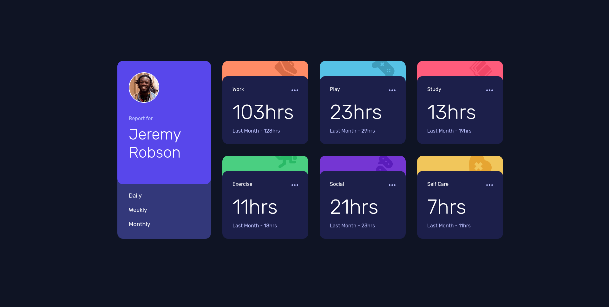

# Time tracking dashboard solution

This is a solution to the [Time tracking dashboard challenge on Frontend Mentor](https://www.frontendmentor.io/challenges/time-tracking-dashboard-UIQ7167Jw). Frontend Mentor challenges help you improve your coding skills by building realistic projects.

## Table of contents

- [Overview](#overview)
  - [The challenge](#the-challenge)
  - [Screenshot](#screenshot)
  - [Links](#links)
- [My process](#my-process)
  - [Built with](#built-with)
  - [What I learned](#what-i-learned)
- [Author](#author)
- [To-do](#to-do)

## Overview

### The challenge

Users should be able to:

- View the optimal layout for the site depending on their device's screen size
- See hover states for all interactive elements on the page
- Switch between viewing Daily, Weekly, and Monthly stats

### Screenshot

### Links

- Solution URL: [Github URL](https://github.com/Divyue30597/time-tracking-dashboard)
- Live Site URL: [Add live site URL here](https://divyue30597.github.io/time-tracking-dashboard)

## My process

### Built with

- Semantic HTML5 markup
- CSS custom properties
- Flexbox
- CSS Grid
- [React](https://reactjs.org/) - JS library

### What I learned

- Explored `Grid` more, how simple and easier it is to use grid over flexblox when working with multiple divs.
- Toggle effect for navigating using react's `useState` hook.
- Proper CSS variable convertion

## Author

- Frontend Mentor - [@Divyue30597](https://www.frontendmentor.io/profile/Divyue30597)
- Github - [@Divyue30597](https://www.github.com/Divyue30597)

## To-do

- Complete mobile first design
